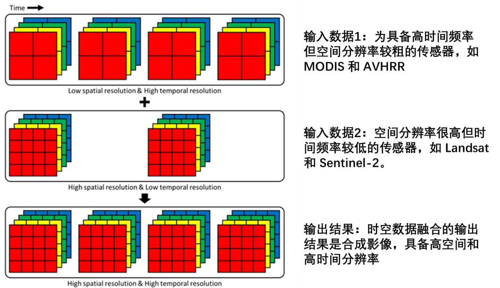

# 时-空数据融合-综述

## 为何要进行时空数据融合？

地表环境的动态变化对生态、农业、城市规划以及灾害监测等领域具有重要意义。  
高空间分辨率的卫星时间序列数据对于研究异质地表的变化尤为关键，因为它能够提供地物类型识别、植被季节性监测、碳通量建模、作物产量估算以及人类活动与自然环境相互作用分析所需的时空信息。  

然而，单一卫星传感器难以同时满足高空间分辨率与高时间分辨率的需求：  

- 高频影像通常空间分辨率较粗（如 **MODIS、AVHRR**）  
- 高空间分辨率影像通常观测间隔较长（如 **Landsat、Sentinel-2**），同时还可能受到云覆盖和大气条件的影响  

为克服上述限制，**时空数据融合**成为一种可行的解决方案。该方法通过整合多源卫星影像，将高频粗分辨率影像与低频高分辨率影像融合，生成既具有高空间分辨率又具备高时间分辨率的合成影像（见图1）。  

时空数据融合在多个实际应用中显示出重要价值，包括：  

- 精细地物分类与变化监测  
- 植被和作物生长状态分析  
- 地表温度或其他环境参数的高分辨率动态监测  
- 城市扩展与建设进度跟踪  
- 自然灾害（如洪水、滑坡）实时监测与评估  

通过提供高质量的密集时间序列数据，时空数据融合方法显著拓宽了遥感在科学研究与实际应用中的能力。  

  
*图1. 时空数据融合示意图*

---

## 时空数据融合方法有哪些？

现有时空数据融合方法可以大体划分为 **五大类**（见图2）：  

  
*图2. 时空数据融合方法分类*

### 1. 基于解混的方法（Unmixing-based methods）
- 基于线性光谱混合理论  
- 代表方法：**MMT、LAC-GAS、STDFA、OB-STVIU**  
- 优点：能够有效处理混合像元问题，在异质景观中表现较好  
- 局限：可能引入较大误差，细节不足  

---

### 2. 基于权重函数的方法（Weight function-based methods）
- 核心：构建权重函数整合输入影像信息  
- 代表方法：**STARFM、ESTARFM、STAARCH、SADFAT、ISKRFM**  
- 优点：实现简单，计算效率高，公开代码易获取  
- 局限：假设条件较强，难以应对复杂或快速变化的地物  

---

### 3. 基于贝叶斯的方法（Bayesian-based methods）
- 核心：最大后验概率（MAP）估计  
- 代表方法：**BME、NDVI-BSFM**、统一融合方法  
- 优点：灵活建模，能量化预测不确定性  
- 局限：模型复杂度高，计算开销大  

---

### 4. 基于学习的方法（Learning-based methods）
- 核心：利用机器学习 / 深度学习建立粗分辨率与精细像元映射  
- 代表方法：**SPSTFM、ELM、随机森林、回归树、CNN、WAIFA**  
- 优点：能捕捉非线性关系，在异质景观中预测精度高  
- 局限：依赖训练样本，计算资源消耗大  

---

### 5. 混合方法（Hybrid methods）
- 核心：整合解混、权重函数、贝叶斯和学习方法  
- 代表方法：**FSDAF、BLEST、STRUM、STIMFM**  
- 优点：适用于复杂场景，提升融合精度和稳定性  

---

## 注释

1. 高空间分辨率与高时间分辨率存在天然冲突，难以兼顾。  
2. 时空数据融合是遥感数据融合的一个子集。  
3. 现有方法中，**基于权重函数的方法应用最为广泛**，而基于学习与混合方法正成为研究热点。  

---

## 参考文献

1. Zhu, X., Cai, F., Tian, J., & Williams, T. K. A. (2018). *Spatiotemporal fusion of multisource remote sensing data: Literature survey, taxonomy, principles, applications, and future directions.* Remote Sensing, 10(4), 527.  
2. 张良培, 沈焕锋. 遥感数据融合的进展与前瞻[J]. 遥感学报, 2016, 20(05):1050-1061.  
3. 郭迪洲. 光学遥感影像可靠性时空融合方法研究[D]. 中国矿业大学, 2024.  
4. Ghamisi, P., Rasti, B., Yokoya, N., Wang, Q., Hofle, B., Bruzzone, L., ... & Benediktsson, J. A. (2019). *Multisource and multitemporal data fusion in remote sensing: A comprehensive review of the state of the art.* IEEE Geoscience and Remote Sensing Magazine, 7(1), 6-39.  
5. Loveland T R, Roy D P, Crawford C J, et al. *Current status of Landsat program, science, and applications.* Remote Sensing of Environment, 2019, 225: 127-147.  
6. Chen B, Huang B, Xu B. *Comparison of Spatiotemporal Fusion Models: A Review.* Remote Sensing, 2015, 7(2): 1798-1835.  
7. 孙悦．遥感数据时空融合算法研究—以 Landsat 与 MODIS 数据为例[D]．徐州：中国矿业大学，2019．  

