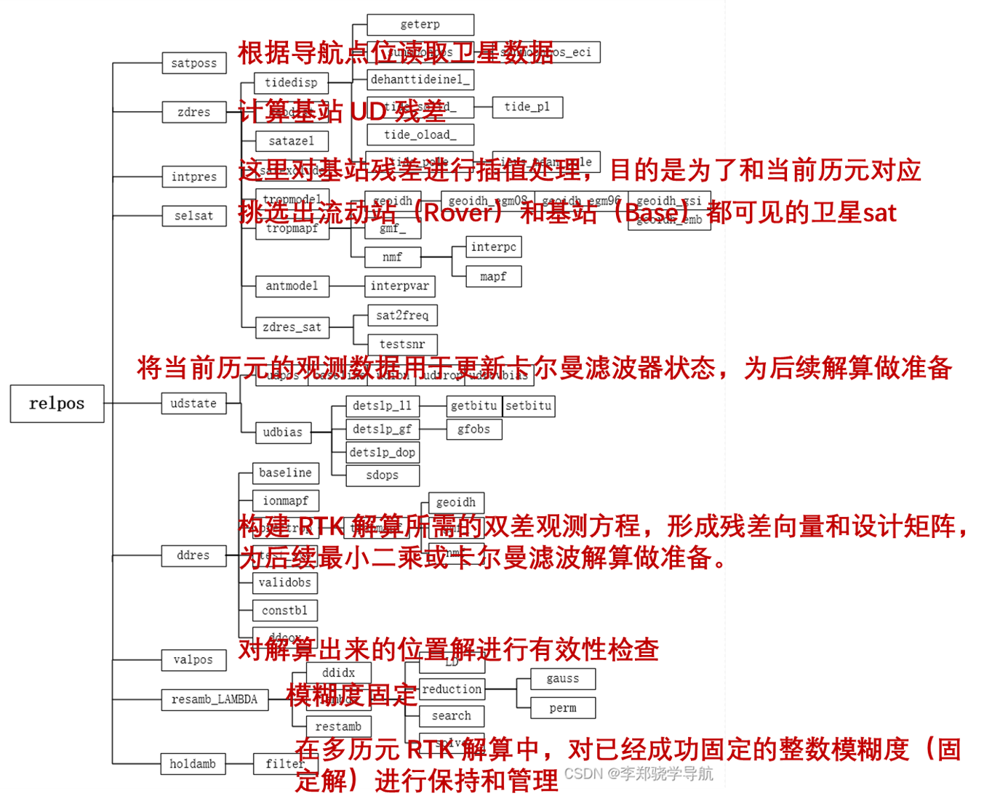

# RTKLIB_RTK源码梳理
## 这里首先对整体的逻辑进行梳理：



## 下面对RTKLIB `relpos()` 函数实现流程讲解

`relpos()` 是 RTKLIB 中实现 **实时动态定位（RTK）** 的核心函数，负责将基准站和流动站观测结合，经过滤波与模糊度固定，输出高精度位置解。

---

## 1. 函数概述

**功能**：根据基准站（Base）和流动站（Rover）的观测及导航星历，计算厘米级 RTK 坐标解。
**输入**：`rtk_t *rtk`、`obsd_t *obs`、`nu, nr`、`nav_t *nav`
**输出**：流动站位置解 `rtk->sol`、模糊度状态、残差、协方差矩阵

```c
static int relpos(rtk_t *rtk, const obsd_t *obs, int nu, int nr,
                  const nav_t *nav)
```

---

## 2. 数据初始化与内存分配

- 分配卫星状态、钟差、观测残差向量、方向余弦、观测频率等内存。
- 初始化基站和流动站卫星状态。
- 设置默认解类型（DGPS / Float / Fixed）。

```c
prcopt_t *opt=&rtk->opt;
gtime_t time=obs[0].time;
double *rs,*dts,*var,*y,*e,*azel,*freq,*v,*H,*R,*xp,*Pp,*xa,*bias,dt;
int i,j,f,n=nu+nr,ns,ny,nv,sat[MAXSAT],iu[MAXSAT],ir[MAXSAT],niter;
int info,vflg[MAXOBS*NFREQ*2+1],svh[MAXOBS*2];
int stat=rtk->opt.mode<=PMODE_DGPS?SOLQ_DGPS:SOLQ_FLOAT;
int nf=opt->ionoopt==IONOOPT_IFLC?1:opt->nf;

rs=mat(6,n); dts=mat(2,n); var=mat(1,n); y=mat(nf*2,n); e=mat(3,n);
azel=zeros(2,n); freq=zeros(nf,n);

for (i=0;i<MAXSAT;i++) {
    rtk->ssat[i].sys=satsys(i+1,NULL);
    for (j=0;j<NFREQ;j++) rtk->ssat[i].vsat[j]=0;
    for (j=1;j<NFREQ;j++) rtk->ssat[i].snr [j]=0;
}
```

---

## 3. 卫星位置计算与基站残差

- 计算卫星位置、钟差和基站 UD 残差
- 验证基站初始位置

```c
satposs(time,obs,n,nav,opt->sateph,rs,dts,var,svh);

if (!zdres(1,obs+nu,nr,rs+nu*6,dts+nu*2,var+nu,svh+nu,nav,rtk->rb,opt,1,
           y+nu*nf*2,e+nu*3,azel+nu*2,freq+nu*nf)) {
    errmsg(rtk,"initial base station position error\n");
    free(rs); free(dts); free(var); free(y); free(e); free(azel);
    free(freq);
    return 0;
}
```

---

## 4. 卫星选择

- 挑选流动站和基准站都可见的卫星
- 确保双差计算可用

```c
if ((ns=selsat(obs,azel,nu,nr,opt,sat,iu,ir))<=0) {
    errmsg(rtk,"no common satellite\n");
    free(rs); free(dts); free(var); free(y); free(e); free(azel);
    free(freq);
    return 0;
}
```

---

## 5. 状态向量更新（滤波前处理）

- 未差状态预测
- 生成初始状态向量和协方差矩阵

```c
udstate(rtk,obs,sat,iu,ir,ns,nav);

xp=mat(rtk->nx,1); Pp=zeros(rtk->nx,rtk->nx); xa=mat(rtk->nx,1);
matcpy(xp,rtk->x,rtk->nx,1);
```

---

## 6. 迭代解算

- 计算流动站 UD 残差
- 计算双差残差和设计矩阵
- 卡尔曼滤波或最小二乘更新状态

```c
niter=opt->niter+(opt->mode==PMODE_MOVEB&&opt->baseline[0]>0.0?2:0);
for (i=0;i<niter;i++) {
    if (!zdres(0,obs,nu,rs,dts,var,svh,nav,xp,opt,0,y,e,azel,freq)) {
        errmsg(rtk,"rover initial position error\n");
        stat=SOLQ_NONE;
        break;
    }
    if ((nv=ddres(rtk,nav,dt,xp,Pp,sat,y,e,azel,freq,iu,ir,ns,v,H,R,vflg))<1) {
        errmsg(rtk,"no double-differenced residual\n");
        stat=SOLQ_NONE;
        break;
    }
    matcpy(Pp,rtk->P,rtk->nx,rtk->nx);
    if ((info=filter(xp,Pp,H,v,R,rtk->nx,nv))) {
        errmsg(rtk,"filter error (info=%d)\n",info);
        stat=SOLQ_NONE;
        break;
    }
}
```

---

## 7. 浮点解验证

- 验证浮点解有效性
- 更新 RTK 状态

```c
nv=ddres(rtk,nav,dt,xp,Pp,sat,y,e,azel,freq,iu,ir,ns,v,NULL,R,vflg);
if (valpos(rtk,v,R,vflg,nv,4.0)) {
    matcpy(rtk->x,xp,rtk->nx,1);
    matcpy(rtk->P,Pp,rtk->nx,rtk->nx);
}
```

---

## 8. 模糊度固定（LAMBDA）

```c
if (stat!=SOLQ_NONE && resamb_LAMBDA(rtk,bias,xa)>1) {
    if (zdres(0,obs,nu,rs,dts,var,svh,nav,xa,opt,0,y,e,azel,freq)) {
        nv=ddres(rtk,nav,dt,xa,NULL,sat,y,e,azel,freq,iu,ir,ns,v,NULL,R,vflg);
        if (valpos(rtk,v,R,vflg,nv,4.0)) {
            if (++rtk->nfix>=rtk->opt.minfix && rtk->opt.modear==ARMODE_FIXHOLD) {
                holdamb(rtk,xa);
            }
            stat=SOLQ_FIX;
        }
    }
}
```

---

## 9. 位置输出

- 输出位置、协方差、速度（动态模式）
- 更新卫星锁定、SNR、周跳状态

```c
for (i=0;i<3;i++) {
    rtk->sol.rr[i] = (stat==SOLQ_FIX ? rtk->xa[i] : rtk->x[i]);
    rtk->sol.qr[i] = (stat==SOLQ_FIX ? (float)rtk->Pa[i+i*rtk->na] : (float)rtk->P[i+i*rtk->nx]);
}
```

---

## 10. 内存释放

```c
free(rs); free(dts); free(var); free(y); free(e); free(azel); free(freq);
free(xp); free(Pp); free(xa); free(v); free(H); free(R); free(bias);

if (stat!=SOLQ_NONE) rtk->sol.stat=stat;
return stat!=SOLQ_NONE;
```

---

## 11. RTK 流程总结

1. 观测同步与卫星筛选  
2. 基站 UD 残差计算（初始验证）  
3. 状态向量更新（滤波预测）  
4. 双差残差计算（`ddres()`）  
5. 迭代滤波更新（`filter()`）  
6. 浮点解验证（`valpos()`）  
7. 模糊度固定（`resamb_LAMBDA()`）  
8. 固定模糊度保持（`holdamb()`）  
9. 输出位置解  


