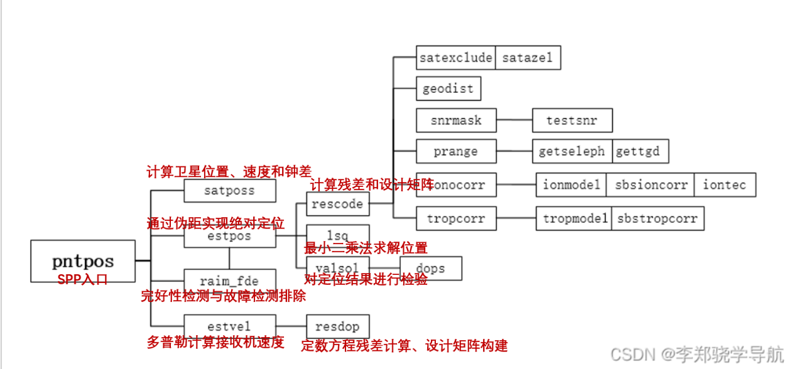
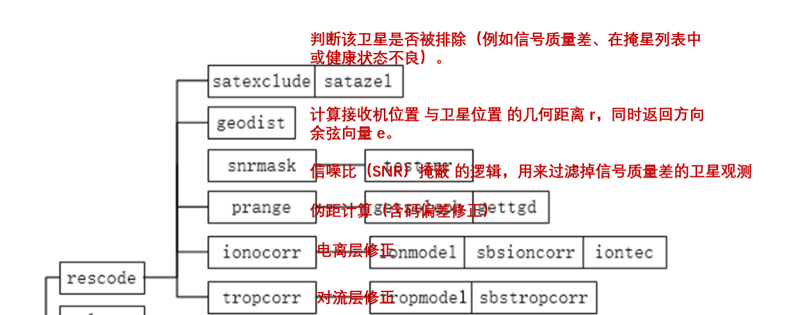

# SPP 定位在 RTKLIB 中的调用关系
## 主要 RTKLIB 函数调用关系图如下图（这里再lixiaohang的基础上进行修改）：


整体的思路是（读取数据-构建方程（也就是计算残差和设计矩阵这一步也体现了线性化过程）-利用最小二乘法计算结果-对结果进行检验）
## 我们先对查看最小二乘法的实现：
```python
/* 最小二乘估计 -----------------------------------------------------
* 通过解法方程进行最小二乘估计 (x = (A*A')^-1 * A * y)
* 参数   : double *A        I   （加权）设计矩阵的转置 (n x m)
*          double *y        I   （加权）观测值向量 (m x 1)
*          int    n,m       I   参数个数和观测数 (n <= m)
*          double *x        O   估计的参数向量 (n x 1)
*          double *Q        O   参数协方差矩阵 (n x n)
* 返回值 : 状态 (0: 正常, >0: 出错)
* 说明   : 对于加权最小二乘，将 A 和 y 替换为 A*w 和 w*y (w = W^(1/2))
*          矩阵按列优先存储 (Fortran 方式)
*-----------------------------------------------------------------------------*/
extern int lsq(const double *A, const double *y, int n, int m, double *x,
               double *Q)
{
    double *Ay;
    int info;
    
    if (m<n) return -1;
    Ay=mat(n,1);
    matmul("NN",n,1,m,1.0,A,y,0.0,Ay); /* Ay=A*y */
    matmul("NT",n,n,m,1.0,A,A,0.0,Q);  /* Q=A*A' */
    if (!(info=matinv(Q,n))) matmul("NN",n,1,n,1.0,Q,Ay,0.0,x); /* x=Q^-1*Ay */
    free(Ay);
    return info;
}
```

## RTKLIB 里 SPP 的最小二乘非常“公式化”，几乎就是把线性代数公式直接套用。因此更应该关注的部分实际上是如何构建残差和设计矩阵，也就是上述的第二部（rescode函数），首先给出其大体的结构图

## rescode() 函数主要用于 计算伪距残差（pseudorange residuals） 并生成对应的设计矩阵，是 GNSS 定位尤其是 RTK/PPP 定位中卡尔曼滤波或最小二乘法的关键步骤。
##  我们将这段函数的代码详细分块讲解，尽量深入每一部分的逻辑和作用。

###  1. 函数定义与参数说明

```c
static int rescode(int iter, const obsd_t *obs, int n, const double *rs,
                   const double *dts, const double *vare, const int *svh,
                   const nav_t *nav, const double *x, const prcopt_t *opt,
                   double *v, double *H, double *var, double *azel, int *vsat,
                   double *resp, int *ns)
```

* **返回值**：`nv`，有效伪距观测数（成功计算残差的卫星数）。
* **输入参数**：

  * `iter`：迭代次数。
  * `obs`：观测数据数组。
  * `n`：观测数量。
  * `rs`：卫星位置和钟差。
  * `dts`：卫星钟差。
  * `vare`：观测方差。
  * `svh`：卫星健康标志。
  * `nav`：星历信息。
  * `x`：状态向量（接收机位置、钟差、系统偏差）。
  * `opt`：定位选项。
* **输出参数**：

  * `v`：残差向量。
  * `H`：设计矩阵。
  * `var`：伪距方差。
  * `azel`：卫星方位角和高度角。
  * `vsat`：有效卫星标志。
  * `resp`：每颗卫星的残差。
  * `ns`：有效观测数。

---

###  2. 局部变量初始化

```c
gtime_t time;
double r,freq, dion = 0.0, dtrp = 0.0, vmeas = 0.0,
       vion = 0.0, vtrp = 0.0, rr[3], pos[3], dtr, e[3], P;
int i,j,nv=0,sat,sys,mask[NX-3]={0};
```

* `r`：卫星到接收机几何距离。
* `freq`：载波频率。
* `dion`、`dtrp`：离子层/对流层延迟。
* `vmeas`、`vion`、`vtrp`：观测误差、离子层误差、对流层误差方差。
* `rr`：接收机 ECEF 坐标。
* `pos`：接收机经纬度高度。
* `dtr`：接收机钟差。
* `e`：卫星到接收机单位矢量。
* `P`：伪距。
* `nv`：有效残差计数。
* `mask`：标记系统偏差状态，避免矩阵秩亏。

---

###  3. 接收机位置提取与坐标转换

```c
for (i=0;i<3;i++) rr[i]=x[i];
dtr=x[3];
ecef2pos(rr,pos);
```

* 提取状态向量中的接收机位置和钟差。
* `ecef2pos()`：将 ECEF 转为经纬度高度，用于仰角计算和对流层模型。

---

###  4. 循环处理每颗卫星观测

```c
for (i=*ns=0;i<n&&i<MAXOBS;i++) {
    vsat[i]=0; azel[i*2]=azel[1+i*2]=resp[i]=0.0;
    time=obs[i].time;
    sat=obs[i].sat;
    if (!(sys=satsys(sat,NULL))) continue;
```

* 初始化卫星状态和残差。
* 获取卫星编号和观测时间。
* 判断卫星系统类型，若无法识别则跳过。

---

### 5. 重复观测与卫星排除

```c
/* reject duplicated observation data */
if (i<n-1&&i<MAXOBS-1&&sat==obs[i+1].sat) {
    trace(2,"duplicated obs data %s sat=%d\n",time_str(time,3),sat);
    i++;
    continue;
}
/* excluded satellite? */
if (satexclude(sat,vare[i],svh[i],opt)) continue;
```

* 去重：连续两条观测来自同一卫星时跳过后者。
* 排除卫星：根据健康状态或用户配置。

---

### 6. 几何距离计算

```c
if ((r=geodist(rs+i*6,rr,e))<=0.0) continue;
```

* `geodist()`：计算卫星到接收机距离和单位向量。
* 距离异常则跳过。

---

### 7. 高级筛选与误差修正（迭代>0）

```c
if (iter>0) {
    if (satazel(pos,e,azel+i*2)<opt->elmin) continue;
    if (!snrmask(obs+i,azel+i*2,opt)) continue;
    if (!ionocorr(time,nav,sat,pos,azel+i*2,opt->ionoopt,&dion,&vion)) continue;
    if ((freq=sat2freq(sat,obs[i].code[0],nav))==0.0) continue;
    dion*=SQR(FREQ1/freq);
    vion*=SQR(FREQ1/freq);
    if (!tropcorr(time,nav,pos,azel+i*2,opt->tropopt,&dtrp,&vtrp)) continue;
}
```

* 仰角筛选、SNR 筛选。
* 离子层和对流层延迟修正及方差计算。
* 多频修正。

---

### 8. 伪距测量与残差计算

```c
if ((P=prange(obs+i,nav,opt,&vmeas))==0.0) continue;
v[nv]=P-(r+dtr-CLIGHT*dts[i*2]+dion+dtrp);
```

* `prange()`：计算伪距及观测方差。
* 残差公式：
  $v = P_{测量} - (r + d_{tr} - c \cdot dt_s + d_{ion} + d_{trop})$

---

### 9. 设计矩阵 H 构造

```c
for (j=0;j<NX;j++) {
    H[j+nv*NX]=j<3?-e[j]:(j==3?1.0:0.0);
}
```

* 前 3 个状态（接收机位置）导数 = `-e[j]`
* 第 4 个状态（接收机钟差）导数 = 1
* 其他系统偏差状态暂时为 0

---

### 10. 系统时间偏差修正

```c
if      (sys==SYS_GLO) {v[nv]-=x[4]; H[4+nv*NX]=1.0; mask[1]=1;}
else if (sys==SYS_GAL) {v[nv]-=x[5]; H[5+nv*NX]=1.0; mask[2]=1;}
else if (sys==SYS_CMP) {v[nv]-=x[6]; H[6+nv*NX]=1.0; mask[3]=1;}
else if (sys==SYS_IRN) {v[nv]-=x[7]; H[7+nv*NX]=1.0; mask[4]=1;}
else mask[0]=1;
```

* 针对不同系统减去系统偏差。
* 更新 H 矩阵。
* `mask` 标记使用过的系统偏差。

---

### 11. 输出与方差计算

```c
vsat[i]=1; resp[i]=v[nv]; (*ns)++;
var[nv++]=varerr(opt,azel[1+i*2],sys)+vare[i]+vmeas+vion+vtrp;
```

* 标记卫星有效，保存残差。
* 计算观测方差：卫星系统方差 + 测量方差 + 离子层/对流层方差。

---

### 12. 输出调试信息

```c
trace(4,"sat=%2d azel=%5.1f %4.1f res=%7.3f sig=%5.3f\n",obs[i].sat,
      azel[i*2]*R2D,azel[1+i*2]*R2D,resp[i],sqrt(var[nv-1]));
```

* 打印卫星编号、仰角、高度、残差、标准差。
* 用于调试和定位分析。

---

### 13. 防止矩阵秩亏（约束）

```c
for (i=0;i<NX-3;i++) {
    if (mask[i]) continue;
    v[nv]=0.0;
    for (j=0;j<NX;j++) H[j+nv*NX]=j==i+3?1.0:0.0;
    var[nv++]=0.01;
}
```

* 对缺失系统偏差添加伪观测，避免矩阵秩亏。

---

### 14. 函数返回

```c
return nv;
```

* 返回有效残差数量。

---

## 总结

`rescode()` 函数的整体流程：

1. 提取接收机状态（位置和钟差）。
2. 遍历观测卫星：

   * 去重、筛选、排除不良观测。
   * 计算几何距离、方位角、高度角。
   * 离子层、对流层延迟修正。
   * 计算伪距残差。
   * 构造设计矩阵 H。
   * 计算观测方差。
3. 对缺失系统偏差添加约束。
4. 返回有效残差数量。

> 生成的 `v`、`H`、`var` 是最小二乘或卡尔曼滤波的核心输入，直接影响定位精度。

